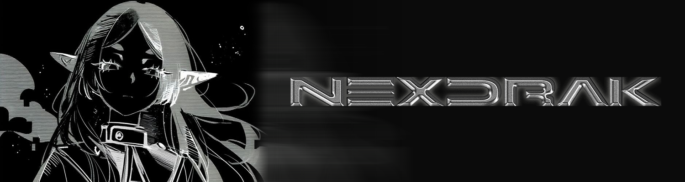

[]([./LICENSE](https://github.com/Rawierdt/PassPai/blob/main/LICENSE))


# NexDrak Official Website

This is the official website for NexDrak, built with Next.js 15 and modern web technologies.

## 🚀 Getting Started

1. Clone the repository
```bash
git clone https://github.com/nexdrak/website.git
cd website
```

2. Install dependencies
```bash
npm install
```

3. Run development server
```bash
npm run dev
```

4. Open [http://localhost:3000](http://localhost:3000)

## 📦 Build & Deployment

```bash
# Build for production
npm run build

# Build for Cloudflare Pages
npm run pages:build

# Start production server
npm start
```

## 📊 Performance Metrics

- **Lighthouse Score**: 95+ (Performance, Accessibility, Best Practices, SEO)
- **Core Web Vitals**: Optimized for LCP, FID, and CLS
- **Bundle Size**: Optimized with tree shaking and code splitting
- **Image Optimization**: WebP/AVIF with responsive sizing

## 📄 License

All rights reserved. This is the official website of NexDrak.

---

**Built with ❤️ by NexDrak Team**
